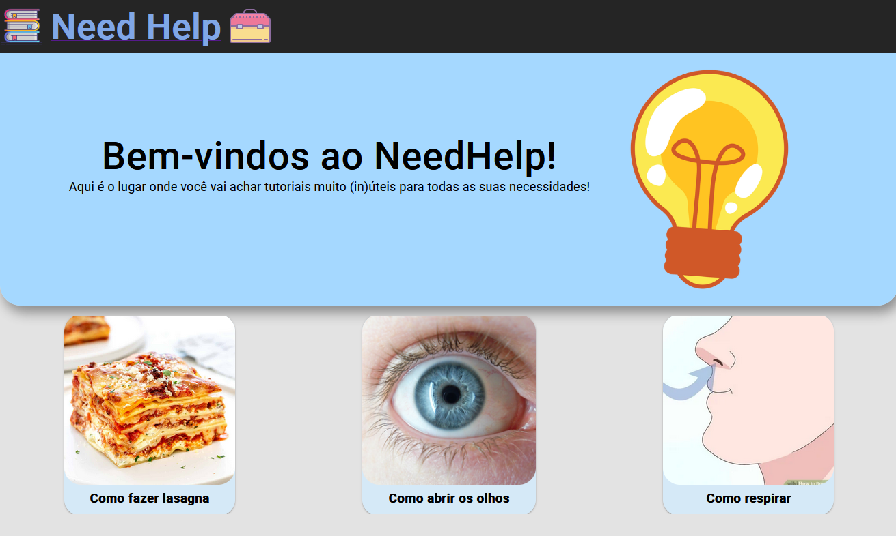

# fiap-grupoj-fase4-entrega1-Angular
Entrega 1 da Fase 4 do MBA de full stack development da FIAP pelo grupo J.

Este projeto foi gerado com [Angular CLI](https://github.com/angular/angular-cli) versão 15.0.4.

##

## Pré-requesitos

Para que este projeto funcione corretamente, é necessário que o projeto presente em <a href="https://github.com/Bullamano/fiap-grupoj-fase3-entrega2-Spring">fiap-grupoj-fase3-entrega2-Spring</a> esteja rodando na máquina e que as instruções da secção "Como rodar o projeto" tenham sido seguidas (pois aquele projeto funciona como o backend deste).

Este projeto é a versão em Angular do projeto presente em <a href="https://github.com/Bullamano/fiap-grupoj-fase3-entrega3-ReactForSpring">fiap-grupoj-fase3-entrega3-ReactForSpring</a>.

##

## Need Help, o site mais (in)útil para seus tutoriais

Com base em sites como o WikiHow e canais do youtube como o "Dad, how do I...", foi criado este protótipo: um site para criar e manter tutoriais para ações e coisas do dia a dia (neste protótipo, com cards mais voltados para situações inusitadas e um tom mais humorístico). Abaixo, em breve, teremos as telas da aplicação e explicações acerca de seu funcionamento (tendo uma versão mais reduzida do projeto realizado em React).

##

## Rodando a aplicação (servidor de desenvolvimento)

Antes de rodar este projeto, certifique-se de que o projeto com a API esteja rodando e de que o runner informado naquele projeto foi rodado com sucesso populando a API.

Em seguida, rode `ng serve --open` no prompt dentro da pasta `needhelp` para iniciar o servidor em `http://localhost:4200/`.

##

### Home Screen

A tela principal da aplicação consiste em um <i>hub</i> com os diversos tutoriais presentes, fornecidos pela API:

  

Esta tela apresenta os tutoriais do runner rodado no projeto da API.

##
  
### Tutorial Screen

Ao clicar em qualquer um dos tutoriais da tela principal, uma nova tela aparecerá, sendo populada com as informações do tutorial escolhido:

  

##
